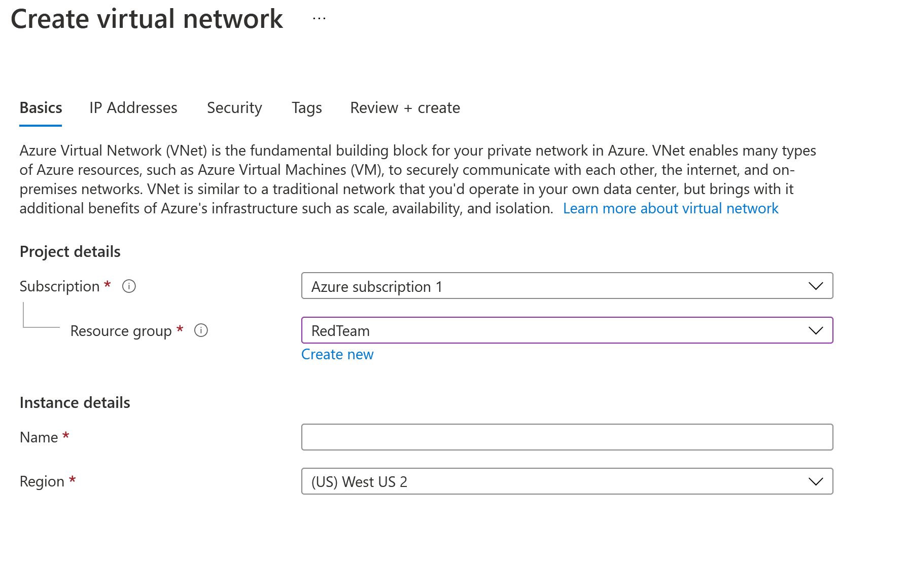

# Setup Guide

Before beginning you want to make sure to update -- sudo apt update -- and upgrade -- sudo apt upgrade -- all virtual machines first! This includes the VMs hosting DVWA and ELK containers. This should be the first step in VM creation and maintenance in general, but it is particularly vital in this case as it will interfere with package installation and playbook execution should the systems be out of date.

1. Initial Azure Configurations

a) Create a Resource Group

  By having all or most of our resources in one Virtual Network, the webservers and jumpbox virtual machines will be a part of the same subnet. Placing all resources in one Resource Group is simply good housekeeping and easier to manage. It is best to keep the names consist to avoid confusion (e.g. EXAMPLE-resource-group and EXAMPLE-vnet). 
  
  Simply type in the type of resource intended to create -- for exmaple, "resource group" -- in the search bar. It will most likely appear as the top search result will be the right resource. Clink on the link and then clikc "+ Add".

 It is necessary to enter a Resource Group name and to select a Region. From there you may select "Review + create" at the bottom of the page, or click "Next: Tags >" to label the Resource Group for further organization (in the case there are multiple Resource Groups). 

b) Setting up the VNet

  Before you can deploy servers and services, there must be a network where these items can be accessed.

  - This network should have the capacity to hold any resource that the Red Team needs, now and in the future.

  - Return to the home screen and search for "net." Choose the search result for Virtual networks.

  - Click on the + Add button on the top-left of the page or the Create virtual network button on the bottom of the page.

  Fill in the network settings:

  - Subscription: Your free subscription should be the only option here. 

  - Resource group: This should be the resource group you created in step two.

  - Name: A descriptive name so it will not get confused with other cloud networks in the same account.

  - Region: Make sure to choose the same region you chose for your resource group.

    - Carefully configuring the region of your resources is important for ensuring  low latency and high availability. Resources should be located as close as possible to those who will be consuming them.

 

